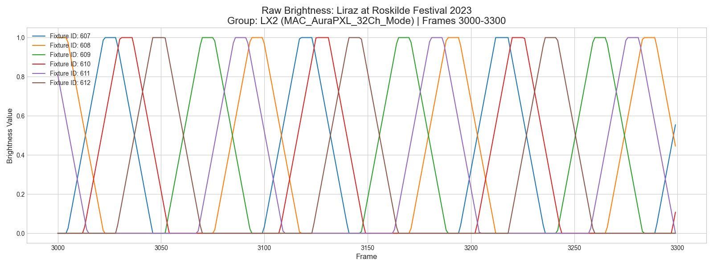
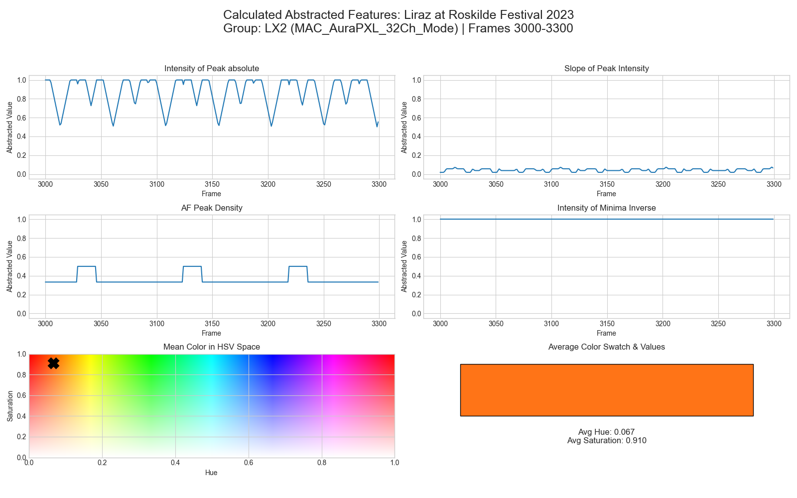

# The Intention-Based Abstraction Layer for AI-Driven Light Show Generation

## 1. The Rationale for Abstraction in Creative AI

The direct application of machine learning models to raw lighting control data, such as DMX-512 streams, presents two fundamental and prohibitive challenges: the **curse of dimensionality** and the **semantic gap**. A single professional light show can generate millions of DMX parameter values per minute, creating a high-dimensional dataset that is computationally intractable for standard deep learning architectures. More critically, these raw values lack inherent artistic meaning; a DMX value of 255 on a specific channel does not, on its own, describe the creative intent of a "sharp, intense strobe" versus a "slow, gentle fade."

To overcome these limitations, this research introduces a crucial abstraction layer. This layer is designed not merely to reduce data, but to translate it into a language of artistic intent. It achieves this through two core principles: **semantic grouping** and **feature extraction**.

### The Principle of Semantic Grouping
First, individual luminaires are clustered into semantically coherent units based on their physical position (e.g., front truss, back truss, stage floor) and aesthetic function (e.g., key light, backlight, effects). This process mirrors the workflow of a human lighting designer, who selects a group of fixtures to create a unified look, such as a full-stage wash. This strategy reduces the output dimensionality from hundreds of individual fixtures to a manageable set of semantic groups (typically 8-16), allowing the model to learn artistically relevant relationships.

### The Benefits of Abstraction
This approach yields several critical benefits that make AI-driven generation feasible:

*   **Achieving a Fixture-Agnostic Model**: By abstracting away the specifics of hardware, the model learns the *what* (the artistic intent, like a rhythmic pulse) rather than the *how* (the specific DMX values for a particular fixture). This makes the trained model universally applicable. The generated abstract output can be translated back to *any* lighting rig through a separate interpretation step, a critical requirement for real-world usability.
*   **Bridging the Semantic Gap**: The layer transforms raw, numerical data into features that represent meaningful artistic concepts like peak intensity, color, and dynamic range. This provides the model with a representation that is directly correlated with creative choices.
*   **Enabling Learnability**: This process provides a necessary **inductive bias**, guiding the model toward learning musically and visually coherent patterns. The abstracted features create a cleaner, more stable signal, focusing the learning process on the meaningful relationships between sound and light.

---

## 2. The Abstracted Features and Their Formulation (Global Intention-Based)

The Global Intention-Based model describes a lighting show as a set of continuous feature curves for each defined group of luminaires. These curves represent the collective behavior and artistic intent for that group over time. The following key parameters are extracted:

*   **Intensity of Peak absolute ($I_{\text{peak}}$)**: Represents the maximum brightness of any single fixture within a group at a given moment. This feature captures the absolute peak energy output of the group, essential for identifying accents and moments of high intensity.
  
$$
I_{\mathrm{peak}}(g,t) = \max_{i \in g} I_i(t)
$$
    
    where $g$ is the set of luminaires in the group and $I_i(t)$ is the intensity of an individual luminaire.

*   **Spatial Intensity Gradient ($\nabla_S I$)**: Measures the sharpness of the intensity distribution *across the fixtures within a group* at a single frame. This feature is crucial for distinguishing between a stark, high-contrast look where a single fixture is highlighted, and a smooth, cohesive wash of light. A high gradient value indicates a sharp falloff in brightness between adjacent fixtures (a "spiky" look), while a low value signifies a smooth intensity distribution across the group (a "wash" or "fan"). This is a spatial metric, not a measure of temporal change.
  
    $$
    \nabla_S I(g, t) = \frac{1}{N_{\text{fixtures}} - 1} \sum_{i=2}^{N_{\text{fixtures}}} |I_i(t) - I_{i-1}(t)|
    $$
    
    where fixtures $i$ in group $g$ are spatially ordered, and $I_i(t)$ is the intensity of an individual fixture.

*   **AF Peak Density ($\rho_{\text{peak}}$)**: An "Alternating Factor" that quantifies the spatial complexity of the intensity distribution across the group at a single frame. A low value indicates a simple look with one or few dominant light sources, while a high value signifies a complex pattern with many alternating points of light.

    $$
    \rho_{\text{peak}}(g, t) = \frac{N_{\text{peaks}}(g, t)}{N_{\text{fixtures}}}
    $$
    
    where $N_{\text{peaks}}$ is the number of distinct spatial intensity peaks across the fixtures in group $g$ at time $t$.

*   **Intensity of Minima Inverse ($I_{\text{min\_inv}}$)**: This metric captures the contrast or dynamic range within the group. By inverting the minimum intensity value, a score near 1.0 indicates high contrast (at least one fixture is near zero intensity), while a score near 0 indicates low contrast (all fixtures are illuminated).

    $$
    I_{\text{min\_inv}}(g, t) = 1 - \min_{i \in g}(I_i(t))
    $$

*   **Color Hue Mean ($\bar{H}$)**: The average hue of all fixtures in the group. This represents the dominant color of the group's output, providing a single value for the overall color aesthetic.
  
    $$
    \bar{H}(g, t) = \text{mean}_{i \in g}(H_i(t))
    $$

*   **Color Saturation Mean ($\bar{S}$)**: The average saturation of all fixtures in the group. This feature describes the purity or vividness of the dominant color, distinguishing between pastel shades and deeply saturated tones.
  
    $$
    \bar{S}(g, t) = \text{mean}_{i \in g}(S_i(t))
    $$

---

## 3. The Journey of Data: A Practical Example

To illustrate this transformation, we will examine a 300-frame (10-second) segment from a performance, focusing on a specific group of fixtures.

### Step 1: The Raw Data Input

The process begins with the raw, preprocessed DMX data, where each fixture's parameters are available as a time-series array. Figure 1 shows the `BRIGHTNESS` values for several individual fixtures within the group. This representation is noisy, complex, and highly dimensional, making it a poor direct input for a machine learning model.

*Figure 1: The raw brightness values for individual fixtures. The high-frequency detail and disparate behavior make it difficult for an AI to discern a single, coherent artistic intent.*

### Step 2: The Transformation Process

The raw parameter data for all fixtures in the group is fed into the abstraction algorithms. The multiple streams of brightness, hue, and saturation are aggregated and transformed into a single set of six feature curves for that group, representing its collective behavior.

### Step 3: The Abstracted Output

The output of this process is shown in Figure 2. The chaotic individual signals have been transformed into a smooth, low-dimensional, and semantically rich representation of the group's behavior.

*Figure 2: The six global intention-based features for the entire group. The raw data has been transformed into a learnable representation capturing artistic intent, including dynamic plots for intensity-related features and visualizations for the average group color.*

---

## 4. Preprocessing for Machine Learning Input

Once the abstraction process is complete, the data must be standardized and prepared for input into the neural network training pipeline. This preprocessing ensures normalization, and compatibility with the model architectures, in this case the Conformer model adaptation based on the [Listen Denoise Action](https://arxiv.org/abs/2211.09707) Paper. 

The preprocessing pipeline, executed via custom Python scripts (e.g., `alternator_to_LDA_lightdata_conv.py`), involves the following key steps:

1.  **Data Loading and Conversion**: The abstracted data (stored as serialized Python objects, e.g., `.pkl`) is loaded and converted into NumPy arrays for efficient numerical processing.
2.  **Feature Slicing and Dimensionality Standardization**: The NumPy array is standardized to a fixed dimensionality. The pipeline slices the data to retain a specific number of features (e.g., the first 60 features, representing 10 groups with 6 features each because of the sufficent adopted model size  of Listen Denoise Action / LDA).
3.  **Dummy Parameter Addition**: To meet the input requirements of specific model implementations (such as the Conformer model adaptation/LDA pipeline), a dummy parameter (a column of zeros) may be appended to the array (e.g., creating a 61st feature).
4.  **Normalization and Clipping**: Crucially, all values in the array are clipped to ensure they fall within the normalized range of `[0.0, 1.0]`. This normalization is essential for stable training of the neural network.
5.  **Output Formatting**: The processed array is saved as a `.npy` file, ready to be ingested by the training pipeline.

This standardized dataset ensures that the complex raw show data is transformed into a tractable, consistent format suitable for learning the intricate mappings between music and light.

---

## 5. Application in Generative Models

The Intention-Based Abstraction Layer serves as the foundational representation for training sequence-to-sequence neural networks. This abstracted lighting data, synchronized with abstracted audio features, allows the models to learn the time-dependent mappings between musical context and lighting aesthetics.

This abstraction layer is utilized in two primary generative architectures adapted from state-of-the-art work in audio-driven motion synthesis:

### 5.1 The Diffusion Model

The primary application of this abstraction layer is within a Diffusion architecture. The Diffusion model ([EDGE](https://arxiv.org/abs/2211.10658)) utilizes the continuous nature of the Intention-Based features to generate long-scale atmospheric continuity and smooth transitions across the duration of a song. It employs a transformer-based diffusion process, conditioned on high-level musical embeddings (e.g., Jukebox), to iteratively refine the lighting sequence from noise into a coherent output.

### 5.2 The Intention-Based Conformer Model

In addition to the Diffusion model, this abstraction layer is also utilized for training an Intention-Based Conformer model. This architecture is specifically tailored to capture precise, rhythmic fidelity and expressive patterns.

#### The Conformer Architecture
The Conformer architecture utilized here is adapted from advancements in audio-driven motion synthesis ([Listen Denoise Action](https://arxiv.org/abs/2211.09707)). It employs a conditional diffusion model structure, similar to DiffWave, but replaces dilated convolutions with **Conformer blocks**.

This hybrid approach is highly effective because it combines the strengths of two mechanisms:

*   **Transformer-based Attention**: Captures long-range temporal dependencies, essential for generating coherent sequences over time.
*   **Convolutional Layers**: Effectively model local structure and relationships between adjacent temporal frames.

This combination is particularly well-suited for generating the coherent, time-dependent rhythmic patterns represented in the intention-based abstraction layer.

#### Model Adaptation and Training

The adaptation of this architecture for lighting control involved modifications to the conditioning and input processing:

*   **Denoising Network**: The core of the architecture is the denoising network, which processes the noisy input sequence (the abstracted lighting data) conditioned on audio features and the diffusion timestep.
*   **Audio Conditioning**: A critical adaptation involved utilizing a comprehensive Music Information Retrieval (MIR) feature set for conditioning, rather than standard features like MFCCs. This expanded feature set includes chroma features, spectral flux, and onset detection features, providing a richer musical context. This information is integrated into each Conformer block via a gating mechanism.
*   **Attention Mechanisms**: The model utilizes Multi-head self-attention to model temporal relationships. It also incorporates Translation Invariant Self Attention (TISA), which allows the model to generalize to sequence lengths different from those seen during training, enabling the generation of coherent lighting sequences of arbitrary duration.
*   **Training Procedure**: The model is trained using the conventional score-matching objective for diffusion models. All normalization routines were specialized to accommodate the characteristics of the intention-based abstraction layer. Optimization is achieved by minimizing the mean squared error (L2 loss), allowing the model to learn the underlying probability distribution of professional lighting patterns.
